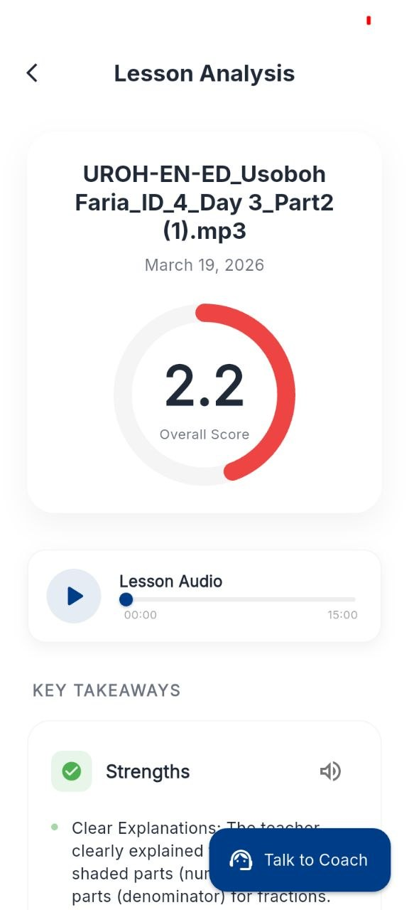
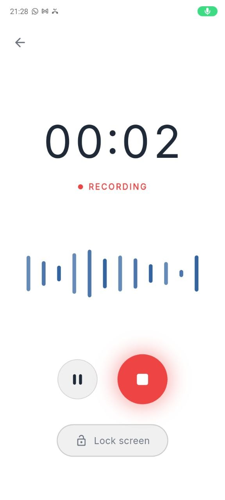
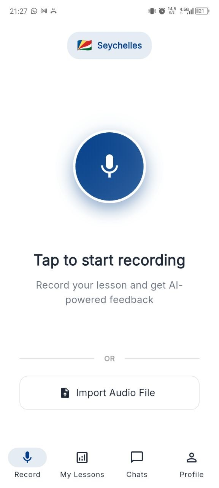

# AI Coach - Frontend (Flutter)

Welcome to the frontend repository of the **AI Coach** application.

## Project Context
The **AI Coach** is a transformative educational technology project developed for **The World Bank**. Our mission is to democratize high-quality pedagogical coaching for teachers in developing nations (such as Senegal, Ethiopia, Tanzania, and Seychelles). 

Historically, evaluating teacher performance required trained observers to sit in classrooms, which is resource-intensive and hard to scale. The AI Coach solves this scaling problem by enabling teachers to easily record their lessons using their own devices. The recordings are then analyzed by Artificial Intelligence against The World Bank's **TEACH Primary observation framework**—an evidence-based tool for measuring and improving teaching practices. The app then delivers personalized, constructive feedback directly to the teacher, fostering continuous professional development.

## The Frontend Application
Built with **Flutter**, this cross-platform frontend serves as the primary touchpoint for educators. It is designed to be intuitive, accessible, and highly responsive, ensuring a seamless user experience even in low-resource environments. Key aspects of the client application include:
- **Seamless Recording Interface**: A robust audio recording experience that works flawlessly on mobile devices, allowing teachers to capture long classroom sessions with pause/resume capabilities.
- **Interactive Coaching & Feedback**: A rich localized user interface that displays the AI-generated TEACH framework analysis, enabling teachers to engage in conversational coaching with an AI assistant.
- **Localization and Theming**: Dynamic country-specific UI customization to provide a tailored, culturally resonant experience for educators across different regions.


## Screenshots

<!-- Add your screenshots here. You can replace the placeholder paths with your actual screenshots -->
| Coaching Feedback | Recording Screen | Home Screen |
| :---: | :---: | :---: |
|  |  |  |

## Features
*   **Audio Recording**: Record lessons directly in the app with pause/resume functionality.
*   **Progress Tracking**: Track improvement over time.
*   **Coaching Chat**: Chat with an AI coach about the specific lesson.

## Run Instructions

1.  Ensure the backend service is running and configured correctly.
2.  Install dependencies:
    ```bash
    flutter pub get
    ```
3.  Run the application:
    ```bash
    # For Web (Chrome)
    flutter run -d chrome

    # For Desktop (Windows)
    flutter run -d windows
    
    # For Android Emulator
    flutter run -d emulator-id
    ```

## Configuration

To connect to a backend running on a different machine (or if using a physical device), update `lib/core/constants/api_constants.dart`:

```dart
static const String baseUrl = 'http://<YOUR_IP>:8080';
```
